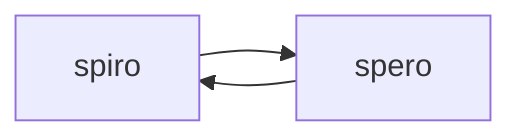

# This is a Test

## This is a subtitletest

### This is a subsubtitletest

#### This is a subsubsubtitletest

This is a test.[^1] (Would *you* **like** ~~some~~ `additional` ``formats?``)

[this is a link.](www.example.com)

``` python
print('this is a code block')
print('this is a multiline code block')
```

> this is a refrence test

- todo:
  - everything

1. get some huggings
2. hug my friends

- [x] Check this list!
- [ ] it has little checkboxs www

| Column 1      | Column 2      |
| ------------- | ------------- |
| Cell 1, Row 1 | Cell 2, Row 1 |
| Cell 1, Row 2 | Cell 1, Row 2 |



Have a nice day.

---


[^1]: this is a footer test.
